<div align="center">


-green?style=for-the-badge)

# UfoTracker — Kubernetes, Docker e GitHub Actions
## Assessment Final (AT) — DR3 DevOps


[](LICENSE)


> **Infraestrutura da Operacao Ufology: PostgreSQL e Redis no Kubernetes, aplicacao Spring Boot containerizada e publicada no Docker Hub, pipelines de CI/CD completos com GitHub Actions**

[](https://linkedin.com/in/becker84)
[](https://github.com/andrebecker84)

</div>

---

## Indice

- [Sobre o Projeto](#sobre-o-projeto)
- [Missoes](#missoes)
- [Tecnologias](#tecnologias)
- [Arquitetura](#arquitetura)
- [Workflows GitHub Actions](#workflows-github-actions)
- [Como Executar](#como-executar)
- [Estrutura do Projeto](#estrutura-do-projeto)
- [Decisoes Tecnicas](#decisoes-tecnicas)
- [Git, Branches e Tags](#git-branches-e-tags)
- [Evidencias de Execucao](#evidencias-de-execucao)
- [Documentacao Completa](#documentacao-completa)

---

## Sobre o Projeto

Este Assessment Final consolida o conhecimento adquirido ao longo da disciplina de DevOps. O projeto cobre quatro missoes praticas de provisionamento de infraestrutura em Kubernetes, containerizacao de aplicacao com Docker, e automacao de pipelines com GitHub Actions.

A solucao entrega:

- **Infraestrutura Kubernetes**: namespace `ufology` com PostgreSQL, Redis e aplicacao ufoTracker isolados e conectados via Services internos
- **Containerizacao**: Dockerfile para a aplicacao Spring Boot ufoTracker, imagem publicada no Docker Hub
- **Configuracao segura**: ConfigMap para dados nao sensiveis, Secrets para credenciais — nada hardcoded nos manifestos
- **CI/CD com GitHub Actions**: seis workflows cobrindo build, testes, variaveis, secrets, monitoramento e resumos

---

## Missoes

| # | Nome | Objetivo | Artefatos |
|---|------|----------|-----------|
| 1 | Banco da Operacao Ufology | Provisionar PostgreSQL no cluster Kubernetes | Namespace, Deployment, Service |
| 2 | Sistema de Cache | Provisionar Redis no cluster Kubernetes | Deployment, Service |
| 3 | Dockerizacao do ufoTracker | Criar Dockerfile, build e push da imagem | Dockerfile, imagem Docker Hub |
| 4 | Implantando a aplicacao | Deploy do ufoTracker com configuracao segura | Deployment, Service, ConfigMap, Secret |

---

## Tecnologias

| Tecnologia | Versao / Tag | Papel |
|-----------|-------------|-------|
| Kubernetes | 1.x | Orquestracao de containers |
| kubectl | — | CLI de administracao do cluster |
| Docker Engine | 26.x | Build e execucao de containers |
| Docker Hub | — | Registry publico da imagem da aplicacao |
| GitHub Actions | — | Pipelines de CI/CD automatizados |
| PostgreSQL | leogloriainfnet/ufodb | Banco de dados relacional da operacao |
| Redis | redis:alpine | Cache em memoria |
| Java | 21 | Linguagem da aplicacao ufoTracker |
| Spring Boot | — | Framework da aplicacao ufoTracker |
| Git | — | Controle de versao e rastreamento de mudancas |

---

## Arquitetura

### Cluster Kubernetes — Namespace ufology

```
kubectl cluster
  └── namespace: ufology
        │
        ├── [ufodb-deployment]   leogloriainfnet/ufodb  (1 replica)
        │     POSTGRES_USER=postgres
        │     POSTGRES_PASSWORD=devops2025!
        │     POSTGRES_DB=ufology
        │         └── [ufodb-service]  ClusterIP :5432
        │
        ├── [redis-deployment]   redis:alpine  (1 replica)
        │         └── [redis-service]  ClusterIP :6379
        │
        ├── [ufo-tracker-deployment]  <dockerhub>/ufo-tracker  (2 replicas)
        │     DB_NAME ←── ConfigMap: app-config
        │     DB_PASSWORD ←── Secret: db-secret
        │         └── [ufo-tracker-service]  ClusterIP :porta-da-app
        │
        ├── ConfigMap: app-config   (DB_NAME=ufology)
        └── Secret: db-secret       (DB_PASSWORD=devops2025!)
```

### Fluxo de provisionamento

```
k8s/ufology.yaml
      │
      ├── [1] Namespace ufology
      ├── [2] Deployment ufodb + Service ufodb-service
      ├── [3] Deployment redis + Service redis-service
      ├── [4] ConfigMap app-config + Secret db-secret
      └── [5] Deployment ufo-tracker + Service ufo-tracker-service
                  │
                  ├── DB_NAME ← ConfigMap
                  ├── DB_PASSWORD ← Secret
                  ├── Conecta em ufodb-service:5432 (PostgreSQL)
                  └── Conecta em redis-service:6379 (Redis)
```

---

## Workflows GitHub Actions

| Arquivo | Trigger | O que faz | Rubricas |
|---------|---------|-----------|---------|
| `hello.yml` | push (toda branch) | Exibe "Hello CI/CD" no log | 2 |
| `tests.yml` | pull_request | checkout + echo "Rodando testes" | 2 |
| `maven-ci.yml` | push para main | ubuntu-latest + build Maven + upload-artifact | 2 |
| `env-demo.yml` | push | DEPLOY_ENV=staging exibido no log | 3 |
| `secret-demo.yml` | push | "API_KEY configurado" sem expor valor | 3 |
| `run-monitor.yml` | push main, manual | vars multinivel + ambiente protegido + summaries + debug | 3, 4, 5 |

### Diferenca entre runners

| Tipo | Hospedagem | Vantagens | Desvantagens |
|------|-----------|-----------|--------------|
| **Hospedados pelo GitHub** | GitHub (nuvem) | Zero configuracao, manutencao pela GitHub, ambiente limpo a cada execucao | Limite de minutos no plano gratuito, sem acesso a recursos internos da rede |
| **Auto-hospedados** | Infraestrutura propria | Acesso a recursos internos, sem limite de minutos, hardware customizavel | Responsabilidade de manutencao, atualizacoes e seguranca e do time |

---

## Como Executar

### Pre-requisitos

- [kubectl](https://kubernetes.io/docs/tasks/tools/) configurado com acesso ao cluster
- [Docker Desktop](https://www.docker.com/products/docker-desktop/) instalado e em execucao
- [Git](https://git-scm.com/) instalado
- Conta no [Docker Hub](https://hub.docker.com/) para push da imagem (Missao 3)

### Missoes 1, 2 e 4 — Kubernetes

```bash
# Clonar o repositorio
git clone https://github.com/andrebecker84/devopsDR3_AT.git
cd devopsDR3_AT

# Aplicar todos os manifestos (namespace + deployments + services + configmap + secret)
kubectl apply -f k8s/ufology.yaml

# Verificar recursos criados no namespace ufology
kubectl get all -n ufology

# Verificar logs do banco
kubectl logs -n ufology deployment/ufodb-deployment

# Verificar logs do Redis
kubectl logs -n ufology deployment/redis-deployment

# Verificar logs da aplicacao
kubectl logs -n ufology deployment/ufo-tracker-deployment

# Descrever um pod para inspecionar variaveis
kubectl describe pod -n ufology -l app=ufo-tracker
```

### Missao 3 — Docker Build e Push

```bash
# Clonar o projeto ufoTracker
git clone https://github.com/leoinfnet/devops2026-ufoTracker.git ufo-tracker-src

# Copiar o Dockerfile para o diretorio do projeto
# (Dockerfile disponivel em ufo-tracker/Dockerfile neste repositorio)

# Build da imagem
docker build -t becker84/ufo-tracker:latest ./ufo-tracker

# Login no Docker Hub
docker login

# Push da imagem
docker push becker84/ufo-tracker:latest
```

### Limpeza do ambiente Kubernetes

```bash
# Remover todos os recursos do namespace ufology
kubectl delete -f k8s/ufology.yaml

# Ou remover o namespace inteiro (remove todos os recursos dentro dele)
kubectl delete namespace ufology
```

---

## Estrutura do Projeto

```
devopsDR3_AT/
│
├── .github/
│   └── workflows/
│       ├── hello.yml          # Parte 2 — "Hello CI/CD" em qualquer push
│       ├── tests.yml          # Parte 2 — checkout + testes em pull_request
│       ├── maven-ci.yml      # Parte 2 — build Maven em push main (nome exigido pelo enunciado)
│       ├── env-demo.yml       # Parte 3 — variavel DEPLOY_ENV=staging
│       ├── secret-demo.yml    # Parte 3 — secret API_KEY configurado
│       └── run-monitor.yml    # Parte 3 — vars multinivel + ambiente + summaries
│
├── k8s/
│   └── ufology.yaml           # Manifestos Kubernetes: Namespace, Deployments, Services, ConfigMap, Secret
│
├── ufo-tracker/
│   └── Dockerfile             # Dockerfile da aplicacao ufoTracker (Missao 3)
│
├── doc/
│   ├── images/
│   │   └── card.svg
│   └── RELATORIO_AT.md        # Relatorio tecnico completo + respostas teoricas + evidencias
│
├── evidencias/                # Capturas de tela (kubectl, docker, GitHub Actions, git log)
│
├── .gitignore
├── LICENSE
└── README.md
```

---

## Decisoes Tecnicas

### 1. Namespace `ufology` para isolamento

Todos os recursos da operacao vivem em um namespace dedicado. Isso garante isolamento logico de outros sistemas do cluster, facilita o controle de acesso por RBAC e permite remocao limpa de todos os recursos com um unico comando.

### 2. Services do tipo ClusterIP — banco e Redis sem exposicao externa

Tanto o PostgreSQL quanto o Redis sao expostos apenas internamente via ClusterIP. A aplicacao os acessa pelos nomes de servico (`ufodb-service` e `redis-service`) via DNS interno do Kubernetes. Nenhuma porta e exposta para fora do cluster — principio do minimo privilegio de exposicao de rede.

### 3. ConfigMap para dados de configuracao, Secret para credenciais

O nome do banco (`DB_NAME=ufology`) e um dado de configuracao nao sensivel — vai no ConfigMap. A senha (`DB_PASSWORD=devops2025!`) e uma credencial sensivel — vai no Secret. Essa separacao segue a recomendacao oficial do Kubernetes e evita que credenciais aparecam em logs ou manifestos versionados.

### 4. Dockerfile multi-stage para o ufoTracker

A imagem de build usa JDK + Maven para compilar. A imagem de runtime usa apenas JRE. A imagem final nao contem codigo-fonte, dependencias de build ou ferramentas de compilacao — menor tamanho e menor superficie de ataque.

### 5. 2 replicas para o ufoTracker, 1 para banco e Redis

A aplicacao tem 2 replicas para demonstrar escalabilidade horizontal e disponibilidade. Banco e Redis ficam com 1 replica no contexto do AT — em producao, PostgreSQL exigiria StatefulSet com PersistentVolumeClaim, e Redis exigiria configuracao de replicacao.

### 6. Secrets gerenciados fora dos manifestos no GitHub Actions

No repositorio GitHub, secrets sao configurados em Settings > Secrets and variables > Actions. Nunca aparecem em arquivos versionados. O valor mascarado aparece como `***` nos logs de execucao.

---

## Git, Branches e Tags

O Git e o mecanismo central do fluxo DevOps neste projeto. Cada push aciona automaticamente o pipeline de CI; pull requests disparam testes de integracao; tags `v*.*.*` podem acionar releases.

### Papel do Git na entrega continua

O Git registra cada mudanca com autor, timestamp e mensagem descritiva. Branches isolam contextos de trabalho (feature, fix, release) sem afetar o tronco principal. Tags marcam pontos estavel do historico — sao a base para releases formais e deploys para producao. O GitHub Actions observa eventos Git (push, pull_request, create de tag) para acionar os workflows automaticamente, conectando a mudanca de codigo ao pipeline de integracao e entrega sem intervencao manual.

### Branches usadas

| Branch | Proposito |
|--------|-----------|
| `main` | Tronco principal — aciona CI de build e deploy |
| `ci/setup` | Configuracao inicial de CI/CD — requisito do enunciado |
| `feat/*` | Desenvolvimento de cada missao isoladamente |

### Tags e releases

Tags `v*.*.*` marcam versoes entregues e sao documentadas no GitHub Releases com titulo, descricao e changelog das mudancas incluidas.

---

## Evidencias de Execucao

As capturas de tela e evidencias completas estao documentadas em **[doc/RELATORIO_AT.md](doc/RELATORIO_AT.md)**.

| Evidencia | Arquivo |
|-----------|---------|
| Recursos Kubernetes no namespace ufology | `evidencias/01-kubectl-get-all.png` |
| Logs do PostgreSQL inicializando | `evidencias/02-ufodb-logs.png` |
| Logs do Redis em execucao | `evidencias/03-redis-logs.png` |
| Docker build da imagem ufoTracker | `evidencias/04-docker-build.png` |
| Docker push para o Docker Hub | `evidencias/05-docker-push.png` |
| Imagem publica no Docker Hub | `evidencias/06-dockerhub-image.png` |
| Pods da aplicacao em execucao (2 replicas) | `evidencias/07-ufo-tracker-pods.png` |
| Execucao do hello.yml no GitHub Actions | `evidencias/08-hello-workflow.png` |
| Execucao do tests.yml no GitHub Actions | `evidencias/09-tests-workflow.png` |
| Execucao do maven-ci.yml no GitHub Actions | `evidencias/10-gradle-ci-workflow.png` |
| Execucao do env-demo.yml no GitHub Actions | `evidencias/11-env-demo-workflow.png` |
| Execucao do secret-demo.yml no GitHub Actions | `evidencias/12-secret-demo-workflow.png` |
| Execucao do run-monitor.yml no GitHub Actions | `evidencias/13-run-monitor-workflow.png` |
| Historico de commits e tags (`git log`) | `evidencias/14-git-log.png` |
| GitHub Release com changelog | `evidencias/15-github-release.png` |

---

## Documentacao Completa

A documentacao detalhada com respostas teoricas, manifestos comentados, decisoes de arquitetura e evidencias de execucao esta disponivel em:

**[doc/RELATORIO_AT.md](doc/RELATORIO_AT.md)**

### Referencias

- [Kubernetes Documentation](https://kubernetes.io/docs/)
- [Docker Documentation](https://docs.docker.com/)
- [GitHub Actions Documentation](https://docs.github.com/en/actions)
- [PostgreSQL Docker Hub](https://hub.docker.com/_/postgres)
- [Redis Docker Hub](https://hub.docker.com/_/redis)
- [ufoTracker — Repositorio Original](https://github.com/leoinfnet/devops2026-ufoTracker/)

---

<div align="center">

**Desenvolvido como Assessment Final da disciplina de DevOps com foco em Kubernetes, Docker e GitHub Actions.**

[](https://kubernetes.io/)
[](https://www.docker.com/)
[](https://github.com/features/actions)



*Instituto Infnet - Engenharia de Software - 2026.*

[](LICENSE)

</div>
