# AT — Kubernetes, Docker e GitHub Actions: UfoTracker

**Disciplina:** DevOps — Pipelines CI/CD (DR3)
**Aluno:** André Luis Becker
**Ano:** 2026

---

## Parte 1 — Avaliação Teórica

### 1. O papel do Git no ciclo de DevOps

O Git é a fundação do ciclo DevOps. Ele registra cada mudança no código com autor, timestamp e mensagem descritiva, criando um histórico auditável e reversível. No contexto de integração e entrega contínuas, o Git conecta a intenção do desenvolvedor ao pipeline de automação: um push dispara o CI, um pull request abre a janela de revisão e os testes automáticos, uma tag marca o artefato candidato a release.

**Branches no CI/CD:** cada branch isola um contexto de trabalho sem afetar o tronco principal. A branch `main` é o gatilho do pipeline de entrega — qualquer merge nela deve ter passado pelo CI. Branches de feature protegem o tronco de código não validado. Branches de release isolam a estabilização de uma versão enquanto o desenvolvimento continua em paralelo.

**Tags no CI/CD:** uma tag `v1.0.0` não é apenas um marcador — ela é o contrato entre o time de desenvolvimento e o time de operações. O pipeline pode ser configurado para acionar o deploy automático de staging ao detectar uma tag `v*.*.*-rc*`, e o deploy de produção ao detectar uma tag `v*.*.*`. A tag torna o processo determinístico: o que entra em produção é exatamente o commit tagueado, não "o último da main".

**Resumo:** Git + branches + tags + GitHub Actions formam o ciclo completo: código → revisão → build → teste → empacotamento → release → deploy — tudo rastreável, repetível e auditável.

---

### 2. Estrutura de um workflow GitHub Actions — jobs, steps e eventos

Um arquivo de workflow GitHub Actions é um YAML que descreve *quando* e *como* executar automações.

**Eventos de acionamento (`on`):** definem o gatilho. `push` aciona em qualquer commit enviado; `pull_request` aciona quando um PR é aberto ou atualizado; `workflow_dispatch` permite acionamento manual; `schedule` cria execuções periódicas via cron.

**Jobs:** unidades de execução independentes que rodam em paralelo por padrão. Cada job corre em um runner separado e pode ter dependências com `needs:`. Jobs com `environment: production` exigem aprovação manual antes de executar.

**Steps:** sequência de ações dentro de um job. Cada step pode ser uma action reutilizável (`uses: actions/checkout@v4`) ou um comando shell (`run: echo "hello"`). Steps compartilham o mesmo runner e filesystem do job.

**Validação YAML:** GitHub Actions valida a estrutura do arquivo antes da execução. Erros de indentação ou chaves inválidas impedem a execução do workflow inteiro. Cada `uses:` deve referenciar uma action com versão fixada (SHA ou tag) para builds reproduzíveis.

**Upload de artefatos:** `actions/upload-artifact` salva arquivos do runner para download posterior. Útil para preservar JARs, relatórios de cobertura ou evidências de execução entre jobs ou entre execuções do workflow.

---

### 3. Runners hospedados pelo GitHub vs auto-hospedados

| Aspecto | Hospedados pelo GitHub | Auto-hospedados |
|---------|----------------------|-----------------|
| **Configuração** | Zero — prontos para uso | Requer instalação e manutenção do agente |
| **Ambiente** | Limpo a cada execução (VM efêmera) | Persistente — pode acumular estado entre execuções |
| **Acesso a rede interna** | Não — apenas internet pública | Sim — acesso a recursos privados da rede corporativa |
| **Limite de minutos** | Sim — plano gratuito tem cota | Não — sem limite de minutos no plano pago |
| **Hardware** | Padronizado (2 vCPU, 7 GB RAM) | Customizável — GPU, RAM grande, SSD NVMe |
| **Segurança** | GitHub gerencia patches e isolamento | Responsabilidade do time — patch, firewall, acesso |
| **Custo** | Incluído no plano GitHub | Custo de infra própria + manutenção |

**Quando usar auto-hospedado:** acesso a banco de dados interno, cluster Kubernetes privado, hardware especializado, ou workloads que esgotam a cota de minutos gratuitos.

**Quando usar hospedado pelo GitHub:** projetos open-source, builds simples, times sem infraestrutura dedicada, ou quando a reproducibilidade de ambiente limpo é prioridade.

---

### 4. Variaveis, Secrets e GITHUB_TOKEN

**Variáveis de ambiente (`env`):** valores não sensíveis declarados no workflow, job ou step. Acessados via `${{ env.NOME }}` ou diretamente como `$NOME` no shell. Visíveis nos logs.

**Variables do repositório (`vars`):** configuradas em Settings > Secrets and variables > Variables. Acessadas via `${{ vars.NOME }}`. Úteis para valores que mudam por ambiente mas não são sensíveis.

**Secrets:** valores sensíveis (senhas, tokens, chaves) configurados em Settings > Secrets and variables > Actions. Acessados via `${{ secrets.NOME }}`. O GitHub automaticamente mascara o valor nos logs — qualquer ocorrência é substituída por `***`.

**GITHUB_TOKEN:** token de autenticação gerado automaticamente pelo GitHub para cada execução de workflow. Permite que o workflow interaja com a API do GitHub (criar releases, comentar PRs, fazer push de artefatos) sem configurar um token pessoal. As permissões do token são limitadas ao repositório em execução e podem ser restritas via `permissions:` no workflow.

**Níveis de declaração de variáveis:**
- Nível de workflow: disponível em todos os jobs
- Nível de job: disponível apenas nos steps daquele job
- Nível de step: disponível apenas no step específico

---

### 5. Monitoramento, debug e resumos em GitHub Actions

**ACTIONS_STEP_DEBUG=true:** variável de repositório (configurada em Settings > Secrets, não em variáveis normais) que habilita logs detalhados de debug. Exibe informações internas dos runners, actions e steps. Útil para diagnosticar falhas de autenticação, problemas de ambiente ou comportamentos inesperados de actions.

**Mensagens customizadas no log:** o GitHub Actions interpreta comandos especiais em saídas de `echo`:
- `echo "::warning::Mensagem de aviso"` — exibe aviso amarelo no log e na interface
- `echo "::error::Mensagem de erro"` — exibe erro vermelho no log e gera falha visível
- `echo "::notice::Mensagem de aviso leve"` — exibe notificação azul

**Job summaries (`$GITHUB_STEP_SUMMARY`):** arquivo especial que acumula conteúdo Markdown exibido na aba "Summary" da execução do workflow. Permite criar relatórios formatados com tabelas, listas e badges diretamente na interface do GitHub, sem precisar abrir os logs brutos.

**Badges de status:** o GitHub expõe um endpoint de badge para cada workflow. O URL segue o padrão:
```
https://img.shields.io/github/actions/workflow/status/<owner>/<repo>/<workflow-file>
```
Incorporar o badge no README.md garante visibilidade imediata do estado do pipeline para qualquer visitante do repositório.

---

## Parte 2 — Missões Práticas

### Missão 1 — Namespace e PostgreSQL

#### Manifesto: Namespace ufology

```yaml
apiVersion: v1
kind: Namespace
metadata:
  name: ufology
```

O namespace isola logicamente todos os recursos da operação. Permite controle de acesso por RBAC, quotas de recursos e remoção limpa de toda a infraestrutura com um único comando.

#### Manifesto: Deployment do PostgreSQL

```yaml
apiVersion: apps/v1
kind: Deployment
metadata:
  name: ufodb-deployment
  namespace: ufology
spec:
  replicas: 1
  selector:
    matchLabels:
      app: ufodb
  template:
    metadata:
      labels:
        app: ufodb
    spec:
      containers:
        - name: ufodb
          image: leogloriainfnet/ufodb:latest
          env:
            - name: POSTGRES_USER
              value: "postgres"
            - name: POSTGRES_PASSWORD
              value: "devops2025!"
            - name: POSTGRES_DB
              value: "ufology"
          ports:
            - containerPort: 5432
```

#### Manifesto: Service do PostgreSQL

```yaml
apiVersion: v1
kind: Service
metadata:
  name: ufodb-service
  namespace: ufology
spec:
  selector:
    app: ufodb
  ports:
    - port: 5432
      targetPort: 5432
  type: ClusterIP
```

O tipo ClusterIP expõe o banco apenas dentro do cluster. Nenhuma porta é acessível externamente — princípio do mínimo privilégio de rede.

#### Comandos de aplicação e validação

```bash
# Aplicar
kubectl apply -f k8s/ufology.yaml

# Verificar namespace criado
kubectl get namespaces | grep ufology

# Verificar pod em execucao
kubectl get pods -n ufology -l app=ufodb

# Verificar logs do PostgreSQL
kubectl logs -n ufology deployment/ufodb-deployment

# Descrever o service
kubectl describe service ufodb-service -n ufology
```

---

### Missão 2 — Redis

#### Manifesto: Deployment do Redis

```yaml
apiVersion: apps/v1
kind: Deployment
metadata:
  name: redis-deployment
  namespace: ufology
spec:
  replicas: 1
  selector:
    matchLabels:
      app: redis
  template:
    metadata:
      labels:
        app: redis
    spec:
      containers:
        - name: redis
          image: redis:alpine
          ports:
            - containerPort: 6379
```

Redis Alpine: imagem baseada em Alpine Linux, significativamente menor que a variante Debian. Adequada para cache em memória onde performance e footprint reduzido são prioridade.

#### Manifesto: Service do Redis

```yaml
apiVersion: v1
kind: Service
metadata:
  name: redis-service
  namespace: ufology
spec:
  selector:
    app: redis
  ports:
    - port: 6379
      targetPort: 6379
  type: ClusterIP
```

#### Comandos de validação

```bash
# Verificar pod em execucao
kubectl get pods -n ufology -l app=redis

# Logs do Redis
kubectl logs -n ufology deployment/redis-deployment

# Testar conectividade interna (a partir de outro pod no namespace)
kubectl exec -n ufology deployment/ufodb-deployment -- \
  sh -c "nc -z redis-service 6379 && echo 'Redis alcancavel'"
```

---

### Missão 3 — Dockerfile do ufoTracker

#### Obtenção do código-fonte

```bash
git clone https://github.com/leoinfnet/devops2026-ufoTracker.git ufo-tracker-src
```

#### Dockerfile

```dockerfile
# Estagio de build: compila o projeto com Maven + JDK 21
FROM maven:3.9-eclipse-temurin-21-alpine AS build
WORKDIR /app
COPY pom.xml .
RUN mvn dependency:go-offline -B
COPY src ./src
RUN mvn package -DskipTests -B

# Estagio de runtime: apenas JRE 21 + JAR compilado
FROM eclipse-temurin:21-jre-alpine
WORKDIR /app
COPY --from=build /app/target/*.jar app.jar
EXPOSE 8080
ENTRYPOINT ["java", "-jar", "app.jar"]
```

Build multi-stage: o estagio de build contém JDK 21, Maven e código-fonte. O estagio de runtime contém apenas o JRE 21 e o JAR. A imagem final não carrega ferramentas de compilação — menor tamanho e menor superfície de ataque. O pré-download de dependências (`dependency:go-offline`) é copiado em camada separada do código-fonte, aproveitando o cache do Docker quando apenas o código muda.

#### Comandos de build e push

```bash
# Build da imagem
docker build -t becker84/ufo-tracker:latest -f ufo-tracker/Dockerfile .

# Login no Docker Hub
docker login

# Push da imagem
docker push becker84/ufo-tracker:latest
```

**Link da imagem no Docker Hub:** https://hub.docker.com/r/becker84/ufo-tracker

---

### Missão 4 — ConfigMap, Secret e Deployment da aplicação

#### Manifesto: ConfigMap

```yaml
apiVersion: v1
kind: ConfigMap
metadata:
  name: app-config
  namespace: ufology
data:
  DB_NAME: "ufology"
```

#### Manifesto: Secret

```yaml
apiVersion: v1
kind: Secret
metadata:
  name: db-secret
  namespace: ufology
type: Opaque
stringData:
  DB_PASSWORD: "devops2025!"
```

`stringData` permite declarar o valor em texto plano no manifesto para aplicação. O Kubernetes armazena internamente em Base64. Em produção, o manifesto com o valor em texto não deve ser versionado — o Secret deve ser criado via CLI ou ferramentas como Sealed Secrets ou External Secrets Operator.

#### Manifesto: Deployment da aplicação

```yaml
apiVersion: apps/v1
kind: Deployment
metadata:
  name: ufo-tracker-deployment
  namespace: ufology
spec:
  replicas: 2
  selector:
    matchLabels:
      app: ufo-tracker
  template:
    metadata:
      labels:
        app: ufo-tracker
    spec:
      containers:
        - name: ufo-tracker
          image: becker84/ufo-tracker:latest
          ports:
            - containerPort: 8080
          env:
            - name: DB_NAME
              valueFrom:
                configMapKeyRef:
                  name: app-config
                  key: DB_NAME
            - name: DB_PASSWORD
              valueFrom:
                secretKeyRef:
                  name: db-secret
                  key: DB_PASSWORD
            - name: SPRING_DATASOURCE_URL
              value: "jdbc:postgresql://ufodb-service:5432/ufology"
            - name: SPRING_REDIS_HOST
              value: "redis-service"
            - name: SPRING_REDIS_PORT
              value: "6379"
```

A aplicação usa os nomes de serviço (`ufodb-service`, `redis-service`) como hostnames — o DNS interno do Kubernetes resolve automaticamente para os IPs dos pods correspondentes dentro do namespace.

#### Manifesto: Service da aplicação

```yaml
apiVersion: v1
kind: Service
metadata:
  name: ufo-tracker-service
  namespace: ufology
spec:
  selector:
    app: ufo-tracker
  ports:
    - port: 8080
      targetPort: 8080
  type: ClusterIP
```

#### Validação completa do namespace

```bash
# Listar todos os recursos do namespace
kubectl get all -n ufology

# Verificar ConfigMap
kubectl describe configmap app-config -n ufology

# Verificar Secret (sem exibir o valor)
kubectl describe secret db-secret -n ufology

# Verificar as 2 replicas da aplicacao em execucao
kubectl get pods -n ufology -l app=ufo-tracker

# Logs de uma replica
kubectl logs -n ufology deployment/ufo-tracker-deployment
```

---

## Parte 3 — Workflows GitHub Actions

### hello.yml

```yaml
name: Hello CI/CD

on:
  push:

jobs:
  hello:
    runs-on: ubuntu-latest
    steps:
      - name: Exibir mensagem de CI/CD
        run: echo "Hello CI/CD"
```

**Link da execução:** [execucao no GitHub Actions](https://github.com/andrebecker84/devopsDR3_AT/actions/workflows/hello.yml)

---

### tests.yml

```yaml
name: Testes CI

on:
  pull_request:

jobs:
  test:
    runs-on: ubuntu-latest
    steps:
      - name: Checkout do codigo
        uses: actions/checkout@v4

      - name: Executar testes
        run: echo "Rodando testes"
```

**Link da execução:** [execucao no GitHub Actions](https://github.com/andrebecker84/devopsDR3_AT/actions/workflows/tests.yml)

---

### maven-ci.yml

> O nome do arquivo `maven-ci.yml` e exigido explicitamente pelo enunciado do AT. O build utiliza Maven, ferramenta nativa do projeto ufoTracker (`pom.xml`).

```yaml
name: Maven CI

on:
  push:
    branches:
      - main

jobs:
  build:
    runs-on: ubuntu-latest
    steps:
      - name: Checkout do codigo
        uses: actions/checkout@v4

      - name: Configurar Java 21
        uses: actions/setup-java@v4
        with:
          java-version: '21'
          distribution: 'temurin'

      - name: Build com Maven
        # -B: modo batch (sem interatividade, adequado para CI)
        # -DskipTests: testes executados no job de testes, nao no build
        run: mvn package -DskipTests -B --file ufo-tracker/pom.xml

      - name: Upload do artefato
        uses: actions/upload-artifact@v4
        with:
          name: ufo-tracker-jar
          path: target/*.jar
```

**Link da execução:** [execucao no GitHub Actions](https://github.com/andrebecker84/devopsDR3_AT/actions/workflows/maven-ci.yml)

---

### env-demo.yml

```yaml
name: Env Demo

on:
  push:

env:
  DEPLOY_ENV: staging

jobs:
  demo:
    runs-on: ubuntu-latest
    env:
      JOB_VAR: "valor-do-job"
    steps:
      - name: Exibir variavel de ambiente
        env:
          STEP_VAR: "valor-do-step"
        run: |
          echo "Ambiente de deploy: $DEPLOY_ENV"
          echo "Variavel do job: $JOB_VAR"
          echo "Variavel do step: $STEP_VAR"
```

Demonstra variáveis em três níveis: workflow (`DEPLOY_ENV`), job (`JOB_VAR`) e step (`STEP_VAR`). Cada nível sobrescreve o anterior se houver conflito de nome.

**Link da execução:** [execucao no GitHub Actions](https://github.com/andrebecker84/devopsDR3_AT/actions/workflows/env-demo.yml)

---

### secret-demo.yml

```yaml
name: Secret Demo

on:
  push:

jobs:
  secret:
    runs-on: ubuntu-latest
    steps:
      - name: Verificar secret API_KEY
        run: |
          if [ -n "${{ secrets.API_KEY }}" ]; then
            echo "API_KEY configurado"
          else
            echo "::warning::API_KEY nao configurado — configure o secret no repositorio"
          fi
```

O valor real do secret nunca aparece no log — o GitHub substitui automaticamente por `***`. O step verifica apenas a presença do secret, exibindo a mensagem de confirmação sem expor o conteúdo.

**Link da execução:** [execucao no GitHub Actions](https://github.com/andrebecker84/devopsDR3_AT/actions/workflows/secret-demo.yml)

---

### run-monitor.yml

```yaml
name: Run Monitor

on:
  push:
    branches:
      - main
  workflow_dispatch:

env:
  APP_NAME: ufo-tracker
  DEPLOY_ENV: staging

jobs:
  validate:
    runs-on: ubuntu-latest
    steps:
      - name: Checkout
        uses: actions/checkout@v4

      - name: Validar variaveis obrigatorias
        env:
          STEP_ENV: "validacao"
        run: |
          echo "::notice::Iniciando validacao de variaveis"
          if [ -z "$APP_NAME" ]; then
            echo "::error::APP_NAME nao definido — configure a variavel no workflow"
            exit 1
          fi
          echo "APP_NAME: $APP_NAME"
          echo "DEPLOY_ENV: $DEPLOY_ENV"
          echo "Step atual: $STEP_ENV"

      - name: Executar testes de verificacao
        run: |
          echo "Rodando testes antes do deploy..."
          echo "::warning::Testes simulados — substitua por chamada real ao test runner"
          echo "Testes concluidos com sucesso"

      - name: Gerar resumo da execucao
        run: |
          echo "## Resumo do Pipeline" >> $GITHUB_STEP_SUMMARY
          echo "" >> $GITHUB_STEP_SUMMARY
          echo "| Campo | Valor |" >> $GITHUB_STEP_SUMMARY
          echo "|-------|-------|" >> $GITHUB_STEP_SUMMARY
          echo "| Aplicacao | $APP_NAME |" >> $GITHUB_STEP_SUMMARY
          echo "| Ambiente | $DEPLOY_ENV |" >> $GITHUB_STEP_SUMMARY
          echo "| Branch | ${{ github.ref_name }} |" >> $GITHUB_STEP_SUMMARY
          echo "| Commit | ${{ github.sha }} |" >> $GITHUB_STEP_SUMMARY
          echo "| Autor | ${{ github.actor }} |" >> $GITHUB_STEP_SUMMARY

  deploy-staging:
    runs-on: ubuntu-latest
    needs: validate
    steps:
      - name: Deploy para staging
        env:
          DOMAIN: ${{ vars.STAGING_DOMAIN }}
        run: |
          echo "Realizando deploy para staging"
          echo "Dominio de staging: $DOMAIN"
          echo "::notice::Deploy de staging concluido"

  deploy-production:
    runs-on: ubuntu-latest
    needs: deploy-staging
    environment: production
    steps:
      - name: Deploy para producao
        env:
          PROD_DOMAIN: ${{ vars.PROD_DOMAIN }}
        run: |
          echo "Realizando deploy para producao"
          echo "Dominio de producao: $PROD_DOMAIN"
          echo "::notice::Deploy de producao concluido com sucesso"

      - name: Criar release via GITHUB_TOKEN
        uses: actions/github-script@v7
        with:
          github-token: ${{ secrets.GITHUB_TOKEN }}
          script: |
            console.log('Release criada via GITHUB_TOKEN — autenticacao automatica')
```

**Destaques:**
- Variáveis em três níveis: workflow (`APP_NAME`, `DEPLOY_ENV`), job (implícito), step (`STEP_ENV`)
- Validação de pré-condições antes de ações críticas (`exit 1` se variável faltando)
- Testes de verificação no job `validate` antes de qualquer deploy
- Job `deploy-production` com `environment: production` — exige aprovação manual configurada em Settings > Environments
- `vars.PROD_DOMAIN` demonstra uso de variáveis de repositório (não secrets)
- `$GITHUB_STEP_SUMMARY` gera tabela Markdown na aba Summary da execução
- `secrets.GITHUB_TOKEN` usado para autenticação na API do GitHub sem token pessoal

**Link da execução:** [execucao no GitHub Actions](https://github.com/andrebecker84/devopsDR3_AT/actions/workflows/run-monitor.yml)

---

## Evidências de Execução

### 01 — Recursos Kubernetes no namespace ufology

Evidência do resultado de `kubectl get all -n ufology` mostrando todos os Deployments, Pods e Services criados.

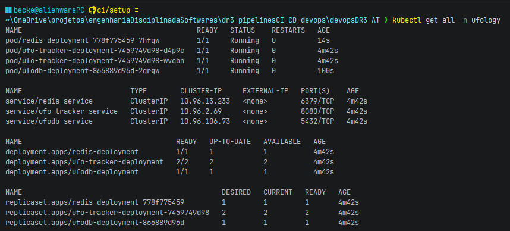

---

### 02 — Logs do PostgreSQL inicializando

Evidência dos logs do pod `ufodb` mostrando a inicialização do banco de dados.

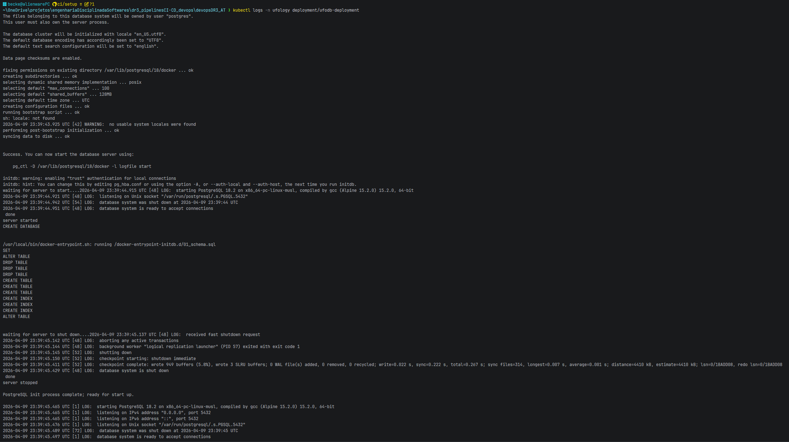

---

### 03 — Logs do Redis em execução

Evidência dos logs do pod `redis` confirmando inicialização correta.

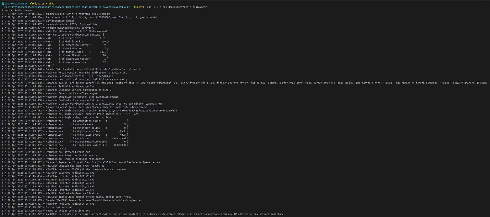

---

### 04 — Docker build da imagem ufoTracker

Evidência do comando `docker build` e sua saída confirmando a construção bem-sucedida da imagem.

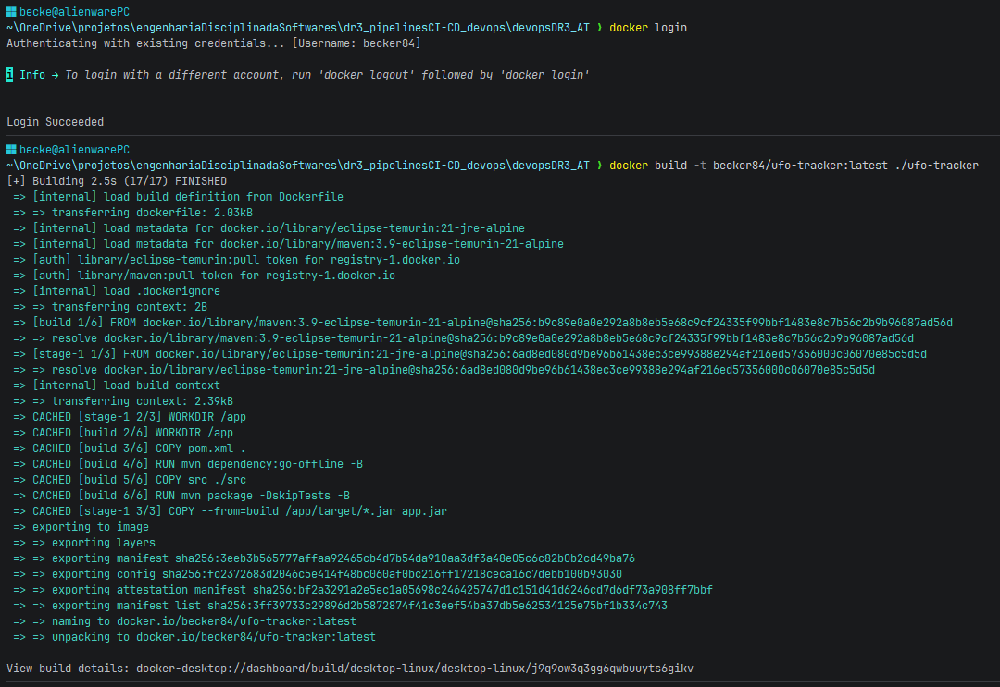

---

### 05 — Docker push para o Docker Hub

Evidência do comando `docker push` e confirmação do upload das camadas para o Docker Hub.

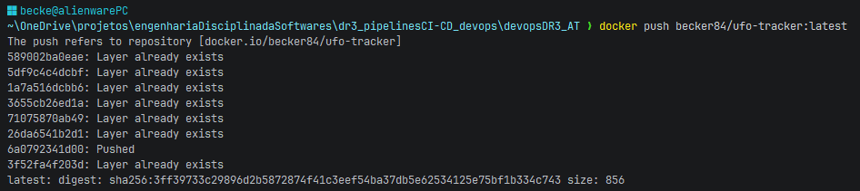

---

### 06 — Imagem pública no Docker Hub

Evidência da imagem disponível publicamente no Docker Hub com tags e metadados.

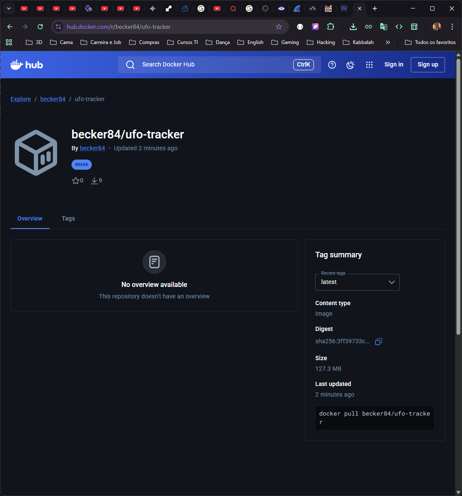

---

### 07 — Pods da aplicação em execução (2 réplicas)

Evidência de `kubectl get pods -n ufology -l app=ufo-tracker` mostrando 2 réplicas em estado Running.

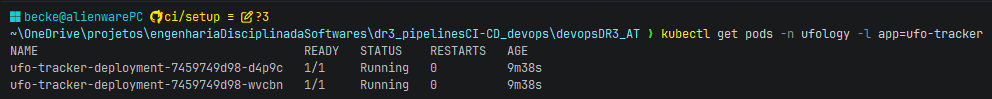

---

### 08 — Execução do hello.yml

Print da execução do workflow `hello.yml` no GitHub Actions mostrando "Hello CI/CD" no log.

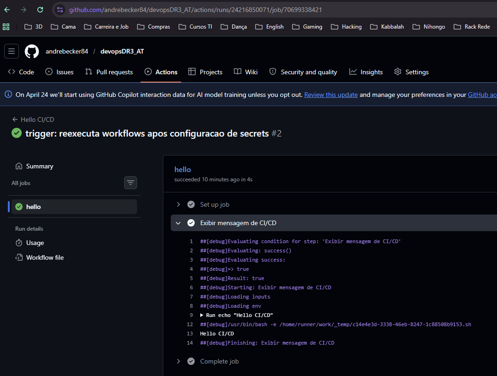

---

### 09 — Execução do tests.yml

Print da execução do workflow `tests.yml` disparado por pull_request.

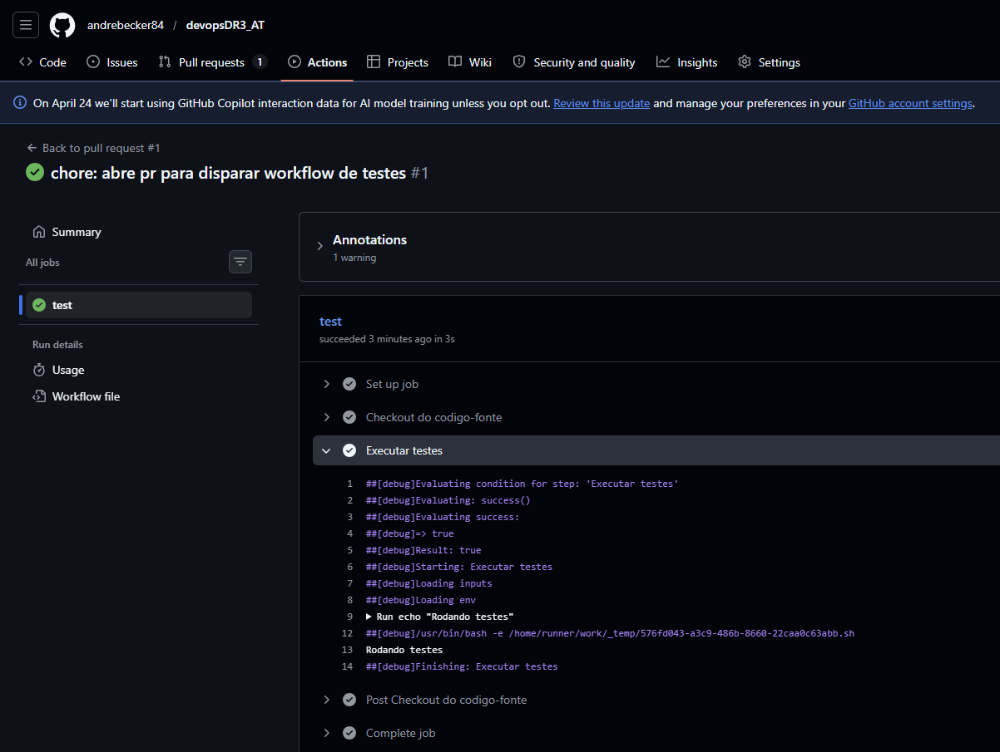

---

### 10 — Execução do maven-ci.yml

Print da execução do workflow `maven-ci.yml` com build e upload do artefato.


---

### 11 — Execução do env-demo.yml

Print da execução do workflow `env-demo.yml` com variáveis em três níveis no log.

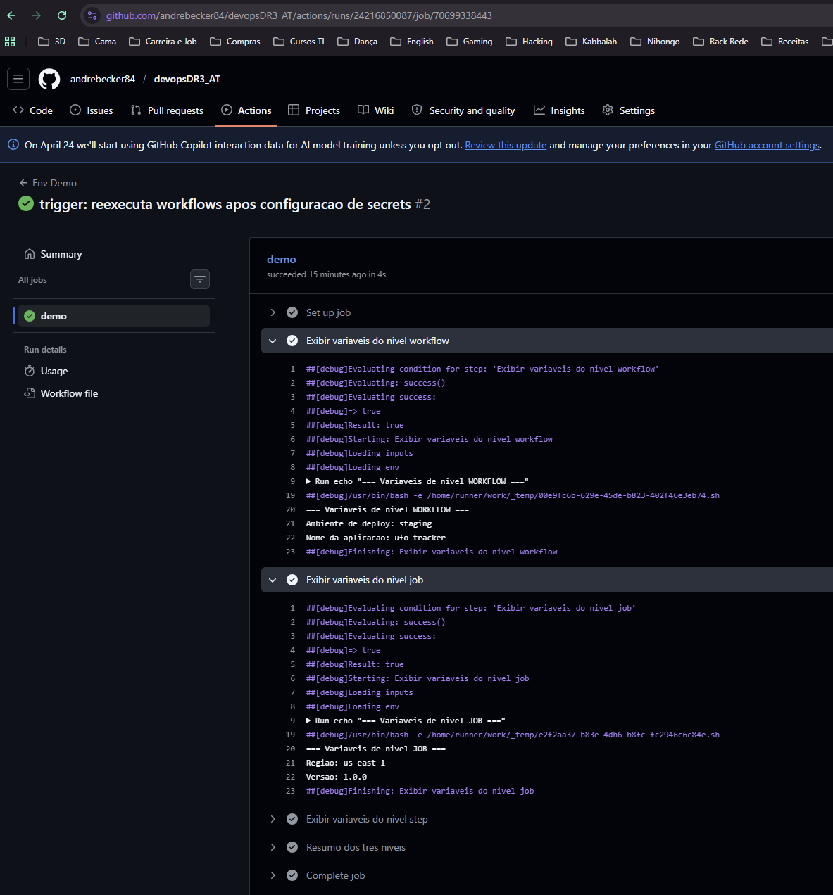

---

### 12 — Execução do secret-demo.yml

Print da execução do workflow `secret-demo.yml` com "API_KEY configurado" sem expor o valor.

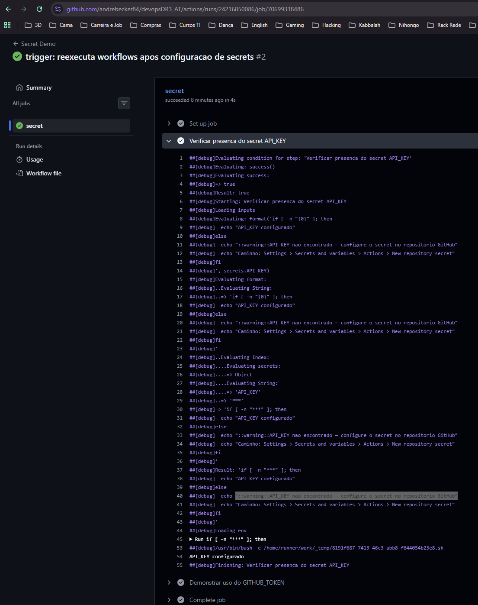

---

### 13 — Execução do run-monitor.yml

Print da execução do workflow `run-monitor.yml` com job summary, aprovação manual e mensagens customizadas.

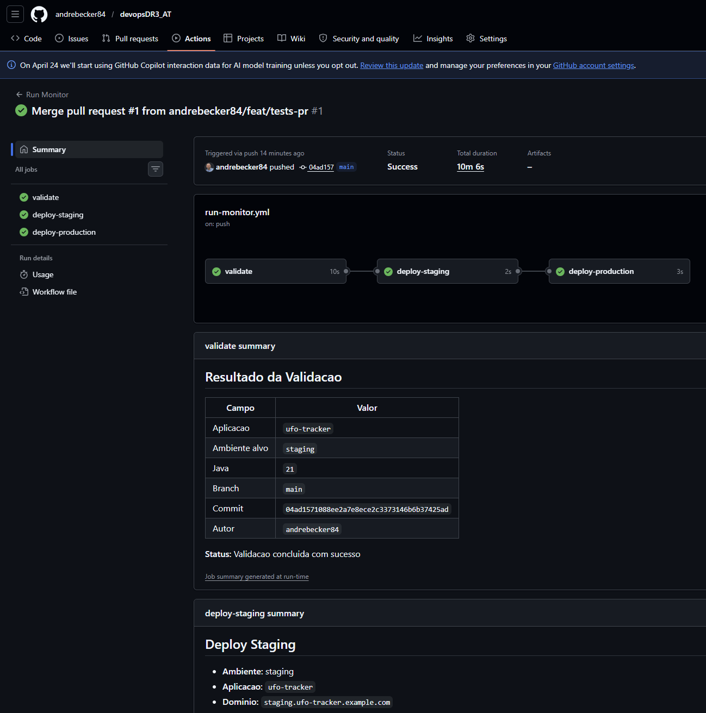

---

### 14 — Histórico de commits e tags

Print de `git log --oneline --decorate` mostrando commits na branch `ci/setup` e tags de release.

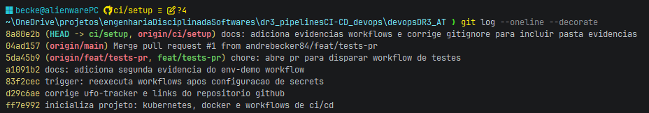

---

### 15 — GitHub Release com changelog

Print do GitHub Release criado com título, descrição e changelog das mudanças.

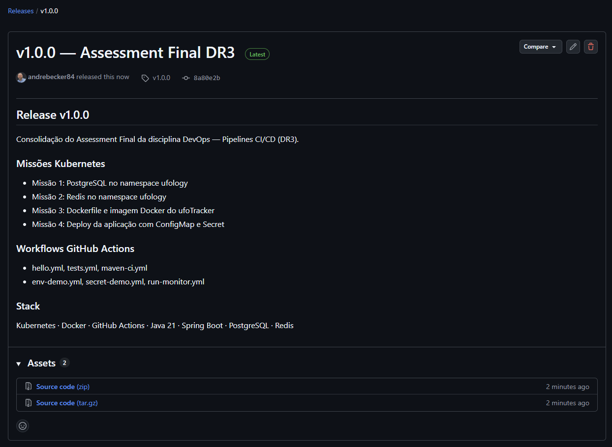
